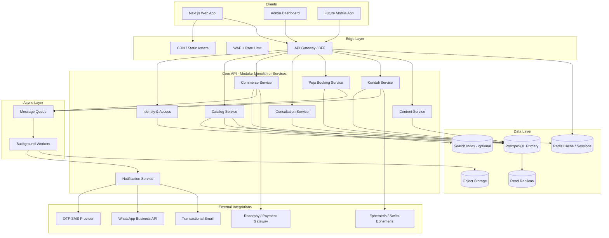
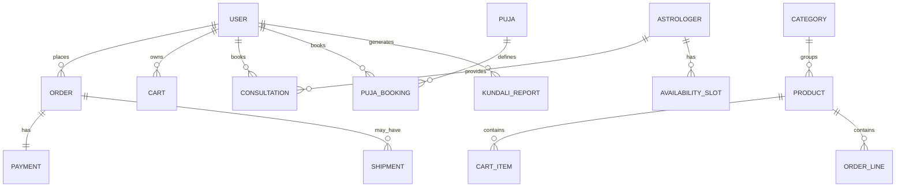
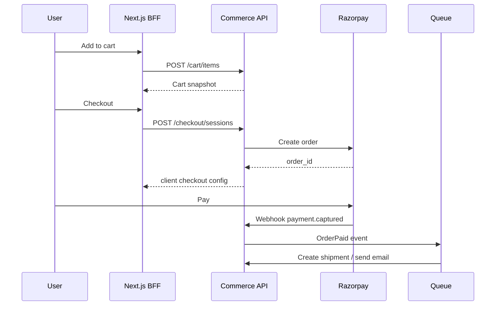

# AstroNext — Backend Architecture

> **Version:** 1.0  
> **Last updated:** May 2026  
> **Scope:** Scalable, dynamic backend for the AstroNext spiritual-commerce platform (Next.js 15 frontend in this repo).

---

## Table of Contents

1. [Executive Summary](#1-executive-summary)
2. [Current State & Gaps](#2-current-state--gaps)
3. [Architecture Principles](#3-architecture-principles)
4. [High-Level System Design](#4-high-level-system-design)
5. [Technology Stack](#5-technology-stack)
6. [Domain Services (Bounded Contexts)](#6-domain-services-bounded-contexts)
7. [Data Model Overview](#7-data-model-overview)
8. [API Design](#8-api-design)
9. [Authentication & Authorization](#9-authentication--authorization)
10. [Core Domain Flows](#10-core-domain-flows)
11. [Dynamic Content & Configuration](#11-dynamic-content--configuration)
12. [Event-Driven Architecture](#12-event-driven-architecture)
13. [Caching & Performance](#13-caching--performance)
14. [Real-Time & Notifications](#14-real-time--notifications)
15. [Media & File Storage](#15-media--file-storage)
16. [Payments & Compliance](#16-payments--compliance)
17. [Kundali Computation Service](#17-kundali-computation-service)
18. [Observability & Reliability](#18-observability--reliability)
19. [Security](#19-security)
20. [Deployment & Scaling](#20-deployment--scaling)
21. [Repository Layout](#21-repository-layout)
22. [Frontend Integration Contract](#22-frontend-integration-contract)
23. [Migration from Static Data](#23-migration-from-static-data)
24. [Phased Rollout](#24-phased-rollout)
25. [Environment Variables](#25-environment-variables)
26. [Open Decisions](#26-open-decisions)

---

## 1. Executive Summary

AstroNext is a **multi-vertical spiritual platform**: Kundali reports, astrologer consultations, two e-commerce catalogs (Divine / Jagannath Store and general E-Store), and Puja booking. The frontend today is **Next.js 15** with **static TypeScript content** and **in-memory client state** (`CartContext`, `PujaBookingContext`).

The recommended backend is a **modular monolith first**, decomposed into **clear bounded contexts**, with a **path to extract hot services** (payments, kundali engine, real-time chat) as traffic grows. Content (products, astrologers, pujas, copy) moves to **database + CMS/admin APIs** so marketing and ops can change the site **without redeploying the frontend**.

**Design goals:**

| Goal | Approach |
|------|----------|
| **Scalable** | Stateless API layer, horizontal pods, read replicas, CDN, async jobs |
| **Dynamic** | CMS-driven entities, feature flags, configurable pricing/rules |
| **Maintainable** | Domain modules, OpenAPI contracts, shared event schema |
| **India-ready** | INR, GST, Razorpay/PhonePe, OTP auth, pincode shipping |

---

## 2. Current State & Gaps

### What exists today (frontend)

| Area | Route / Module | Data source | Backend today |
|------|----------------|-------------|---------------|
| Home | `/` | Static copy | None |
| Kundali Patra | `/kundali` | Marketing copy + images | No chart generation API |
| Astrologers | `/astrologers`, `/astrologers/:id` | `astrologersData.ts` | No profiles API, no booking |
| Divine Store | `/divine-store`, `/product/:id` | `jgStoreProducts.ts` | Cart is React state only |
| E-Store | `/estore` | `estoreProducts.ts` | Same |
| Puja | `/puja` | `pujasData.ts` | Modal UI only |
| Auth | `/login`, `/signup` | Forms | `handleSubmit` no-op |

### Gaps the backend must close

- Persistent **users**, **sessions**, **profiles**
- **Catalog** CRUD with inventory, categories, SEO slugs
- **Cart → checkout → order** with payment webhooks
- **Puja booking** workflow (slot, address, priest assignment, status)
- **Consultation booking** (astrologer availability, per-minute billing or packages)
- **Kundali generation** (birth data → chart PDF/API)
- **Admin panel** for non-developers
- **Analytics**, audit logs, and notification delivery

---

## 3. Architecture Principles

1. **API-first** — OpenAPI 3.1 spec is the contract; frontend uses typed clients generated from spec.
2. **Bounded contexts** — Each business area owns its schema and publishes integration events; avoid shared “god tables.”
3. **Idempotency** — All payment and order mutations accept `Idempotency-Key`.
4. **Soft multi-tenancy** — Optional `tenant_id` on catalog/content for future white-label temples or partner stores.
5. **Fail closed** — AuthZ checked at API gateway and again in service layer.
6. **Evolve, don’t rewrite** — Phase 1 modular monolith; extract services when SLO or team boundaries demand it.

---

## 4. High-Level System Design

### 4.1 Logical architecture



### 4.2 BFF pattern with Next.js

Use **Next.js Route Handlers** or **Server Actions** as a thin **Backend-for-Frontend (BFF)** layer:

- Keeps secrets server-side (`API_SECRET`, payment keys)
- Aggregates multiple backend calls into one round-trip for listing pages
- Sets HTTP-only cookies for session tokens

```
Browser → Next.js BFF (/api/*) → Core API (internal network)
```

For high scale, the BFF stays; the Core API scales independently behind a private VPC.

### 4.3 Deployment topology (production target)

```
                    ┌─────────────┐
                    │  Cloudflare │
                    │  CDN + WAF  │
                    └──────┬──────┘
                           │
              ┌────────────┴────────────┐
              │                         │
       ┌──────▼──────┐           ┌──────▼──────┐
       │  Vercel /   │           │  API LB     │
       │  Next.js    │           │  (K8s/ECS)  │
       └──────┬──────┘           └──────┬──────┘
              │                         │
              └────────────┬────────────┘
                           │
                    ┌──────▼──────┐
                    │  Core API   │  (N replicas, HPA on CPU/latency)
                    └──────┬──────┘
         ┌─────────────────┼─────────────────┐
         │                 │                 │
   ┌─────▼─────┐    ┌──────▼──────┐   ┌─────▼─────┐
   │ PostgreSQL│    │    Redis    │   │    S3     │
   │  + replica│    │   cluster   │   │  + CDN    │
   └───────────┘    └─────────────┘   └───────────┘
```

---

## 5. Technology Stack

### Recommended (balanced for team velocity + scale)

| Layer | Choice | Rationale |
|-------|--------|-----------|
| **Runtime** | Node.js 22 LTS + TypeScript | Aligns with Next.js team skills |
| **API framework** | NestJS or Fastify + Zod | NestJS for large teams; Fastify for lean monolith |
| **ORM** | Prisma or Drizzle | Migrations, type-safe queries |
| **Database** | PostgreSQL 16 | JSONB for flexible metadata, strong consistency |
| **Cache** | Redis 7 | Sessions, catalog cache, rate limits |
| **Queue** | BullMQ (Redis) → SQS later | Job retries, scheduled puja reminders |
| **Search** | Meilisearch or OpenSearch | Product/astrologer faceted search |
| **Object storage** | S3-compatible (AWS S3 / R2) | Images, Kundali PDFs |
| **Auth** | JWT (access) + refresh rotation + optional OAuth | Mobile-ready |
| **API docs** | OpenAPI + Scalar/Swagger UI | Contract with frontend |
| **IaC** | Terraform or Pulumi | Reproducible environments |

### Alternative stacks (when to consider)

- **Go** for Kundali/ephemeris worker (CPU-bound, low memory)
- **Python** if integrating heavy ML for predictions later
- **Supabase** for rapid MVP (Postgres + Auth + Storage) — migrate to custom API at scale

---

## 6. Domain Services (Bounded Contexts)

Each module maps to frontend routes and static data files today.

| Service | Responsibility | Maps from frontend |
|---------|----------------|-------------------|
| **identity** | Users, roles, OTP, sessions, profiles | `AuthPage`, login/signup |
| **catalog** | Products, categories, inventory, pricing rules | `jgStoreProducts.ts`, `estoreProducts.ts` |
| **commerce** | Cart, checkout, orders, shipments, refunds | `CartContext` |
| **consultation** | Astrologer profiles, availability, sessions, ratings | `astrologersData.ts`, WhatsApp CTA |
| **puja** | Puja catalog, bookings, priest scheduling | `pujasData.ts`, `PujaBookingContext` |
| **kundali** | Birth input, chart compute, report storage | `KundaliPatraPage` |
| **content** | Site copy, banners, SEO, feature flags | `siteCopy.ts`, `kundaliCopy.ts` |
| **notification** | Email, SMS, WhatsApp, push | Footer social, chat widgets |
| **admin** | CRUD across domains, approvals, reports | New admin app |

### Service communication rules

- **Synchronous:** User-facing reads via REST from BFF; cross-context reads via internal HTTP or shared read models.
- **Asynchronous:** Order placed, payment captured, puja confirmed → domain events on queue.
- **No direct DB access** across contexts — only through APIs or materialized views owned by one team.

### Extraction order (when scaling)

1. `kundali` (CPU + ephemeris libs)
2. `notification` (provider rate limits)
3. `commerce` + payment webhooks (isolation for PCI scope)
4. `consultation` (real-time scheduling)

---

## 7. Data Model Overview

Identifiers use **UUID v7** (time-sortable) in DB; public APIs may expose **slug** or legacy numeric `id` during migration.

### 7.1 Core entities (ER sketch)



### 7.2 Table definitions (PostgreSQL)

#### `users`

| Column | Type | Notes |
|--------|------|-------|
| id | UUID PK | |
| email | CITEXT UNIQUE | Nullable if phone-only |
| phone | VARCHAR(15) UNIQUE | E.164 |
| password_hash | TEXT | Nullable for OTP/OAuth users |
| name | VARCHAR(120) | |
| role | ENUM | `customer`, `astrologer`, `admin`, `ops` |
| email_verified_at | TIMESTAMPTZ | |
| phone_verified_at | TIMESTAMPTZ | |
| metadata | JSONB | Preferences, locale |
| created_at | TIMESTAMPTZ | |

#### `products`

| Column | Type | Notes |
|--------|------|-------|
| id | UUID PK | |
| store_type | ENUM | `divine`, `estore` — matches two front catalogs |
| slug | VARCHAR UNIQUE | SEO URL |
| legacy_id | INT | Migration from `101`, `301`, etc. |
| name | VARCHAR | |
| category_id | UUID FK | |
| price_paise | BIGINT | Integer money (INR × 100) |
| original_price_paise | BIGINT | Nullable |
| description | TEXT | Short |
| description_long | TEXT | |
| rating_avg | DECIMAL(3,2) | Denormalized |
| review_count | INT | |
| in_stock | BOOLEAN | |
| inventory_count | INT | Optional for MVP |
| images | JSONB | `[{ url, alt, sort }]` |
| metadata | JSONB | `iconBg`, badges, etc. |
| status | ENUM | `draft`, `published`, `archived` |
| published_at | TIMESTAMPTZ | |

#### `astrologers`

| Column | Type | Notes |
|--------|------|-------|
| id | UUID PK | |
| user_id | UUID FK | Optional link to login |
| legacy_id | INT | e.g. 301 |
| name | VARCHAR | |
| specialty | VARCHAR | |
| title | VARCHAR | |
| tagline | TEXT | |
| bio | TEXT | |
| bio_long | TEXT | |
| price_per_minute_paise | INT | |
| rating_avg | DECIMAL | |
| review_count | INT | |
| consultation_count | INT | Counter cache |
| experience_years | INT | |
| languages | TEXT[] | |
| specialities | JSONB | `[{ title, description }]` |
| avatar_url | TEXT | |
| portrait_url | TEXT | |
| online_status | ENUM | `online`, `busy`, `offline` |
| verified | BOOLEAN | |
| status | ENUM | `pending`, `active`, `suspended` |

#### `pujas`

| Column | Type | Notes |
|--------|------|-------|
| id | UUID PK | |
| legacy_id | INT | |
| title | VARCHAR | |
| price_paise | INT | |
| duration_minutes | INT | |
| priest_count | INT | |
| benefits | JSONB | string array |
| status | ENUM | |

#### `puja_bookings`

| Column | Type | Notes |
|--------|------|-------|
| id | UUID PK | |
| user_id | UUID FK | |
| puja_id | UUID FK | |
| scheduled_at | TIMESTAMPTZ | |
| address | JSONB | Full shipping/ritual location |
| status | ENUM | `pending`, `confirmed`, `in_progress`, `completed`, `cancelled` |
| payment_id | UUID FK | |
| notes | TEXT | |

#### `carts` / `cart_items`

Server-persisted cart (optional Phase 2); guest carts via `guest_token` in Redis.

#### `orders` / `order_lines` / `payments` / `shipments`

Standard e-commerce with GST breakdown fields (`cgst`, `sgst`, `igst` paise).

#### `consultations`

| Column | Type | Notes |
|--------|------|-------|
| id | UUID PK | |
| user_id | UUID FK | |
| astrologer_id | UUID FK | |
| type | ENUM | `chat`, `call`, `video` |
| scheduled_at | TIMESTAMPTZ | |
| duration_minutes | INT | |
| amount_paise | INT | |
| status | ENUM | `scheduled`, `active`, `completed`, `cancelled`, `no_show` |
| channel_ref | VARCHAR | WhatsApp / Twilio room id |

#### `kundali_reports`

| Column | Type | Notes |
|--------|------|-------|
| id | UUID PK | |
| user_id | UUID FK | Nullable for guest purchase |
| birth_data | JSONB | date, time, lat, lon, timezone |
| chart_data | JSONB | Computed positions |
| pdf_url | TEXT | S3 signed URL |
| tier | ENUM | `basic`, `detailed`, `premium` |
| status | ENUM | `processing`, `ready`, `failed` |

#### `content_blocks`

CMS key-value: `key` (e.g. `kundali.hero.title`), `locale`, `value` (JSON), `version`.

---

## 8. API Design

### 8.1 Conventions

- **Base URL:** `https://api.astronext.com/v1`
- **Format:** JSON (`application/json`)
- **Auth:** `Authorization: Bearer <access_token>`
- **Pagination:** `?page=1&limit=20` → `{ data, meta: { page, limit, total } }`
- **Errors:** RFC 7807 Problem Details

```json
{
  "type": "https://api.astronext.com/errors/validation",
  "title": "Validation failed",
  "status": 422,
  "errors": [{ "field": "email", "message": "Invalid format" }]
}
```

### 8.2 Resource endpoints (v1)

#### Identity

| Method | Path | Description |
|--------|------|-------------|
| POST | `/auth/register` | Email/password signup |
| POST | `/auth/login` | Returns access + refresh tokens |
| POST | `/auth/otp/send` | Phone OTP |
| POST | `/auth/otp/verify` | Verify + issue tokens |
| POST | `/auth/refresh` | Rotate refresh token |
| POST | `/auth/logout` | Revoke refresh |
| GET | `/users/me` | Profile |
| PATCH | `/users/me` | Update profile |

#### Catalog (public)

| Method | Path | Description |
|--------|------|-------------|
| GET | `/products` | Filter: `store_type`, `category`, `q`, `in_stock` |
| GET | `/products/:slug` | Detail by slug |
| GET | `/categories` | Tree per store |
| GET | `/astrologers` | List with filters (`online`, `language`, `min_rating`) |
| GET | `/astrologers/:slug` | Detail + related |
| GET | `/pujas` | Puja catalog |

#### Commerce

| Method | Path | Description |
|--------|------|-------------|
| GET | `/cart` | Current user/guest cart |
| POST | `/cart/items` | `{ product_id, quantity }` |
| PATCH | `/cart/items/:id` | Update qty |
| DELETE | `/cart/items/:id` | Remove |
| POST | `/checkout/sessions` | Create Razorpay order |
| POST | `/orders` | Place order (idempotent) |
| GET | `/orders` | User order history |
| GET | `/orders/:id` | Detail + shipment |

#### Puja

| Method | Path | Description |
|--------|------|-------------|
| POST | `/puja-bookings` | Create booking |
| GET | `/puja-bookings` | User bookings |
| GET | `/puja-bookings/:id` | Status |

#### Consultation

| Method | Path | Description |
|--------|------|-------------|
| GET | `/astrologers/:id/availability` | Slots |
| POST | `/consultations` | Book session |
| GET | `/consultations` | User sessions |
| POST | `/consultations/:id/cancel` | Cancel policy |

#### Kundali

| Method | Path | Description |
|--------|------|-------------|
| POST | `/kundali/reports` | Submit birth data → async job |
| GET | `/kundali/reports/:id` | Poll status / download |
| GET | `/kundali/reports/:id/pdf` | Signed redirect |

#### Content (public)

| Method | Path | Description |
|--------|------|-------------|
| GET | `/content/blocks` | `?keys=kundali.hero.title,...` |
| GET | `/content/feature-flags` | Toggle experiments |

#### Admin (protected `admin` role)

| Method | Path | Description |
|--------|------|-------------|
| CRUD | `/admin/products`, `/admin/astrologers`, ... | Full management |
| POST | `/admin/media/upload` | Presigned URL flow |
| GET | `/admin/orders` | Ops dashboard |
| PATCH | `/admin/puja-bookings/:id` | Status updates |

### 8.3 Webhooks (incoming)

| Source | Path | Purpose |
|--------|------|---------|
| Razorpay | `POST /webhooks/razorpay` | Payment captured/failed |
| WhatsApp | `POST /webhooks/whatsapp` | Inbound messages (future) |
| Shiprocket / Delhivery | `POST /webhooks/shipping` | Tracking updates |

All webhooks: verify signature, persist event, enqueue handler, return 200 quickly.

---

## 9. Authentication & Authorization

### 9.1 Token strategy

| Token | TTL | Storage |
|-------|-----|---------|
| Access JWT | 15 min | Memory (SPA) or BFF session |
| Refresh token | 30 days | HTTP-only cookie, rotated on use |

JWT claims: `sub` (user id), `role`, `session_id`.

### 9.2 RBAC matrix

| Resource | customer | astrologer | ops | admin |
|----------|----------|------------|-----|-------|
| Own orders/bookings | ✓ | ✓ | ✓ | ✓ |
| Astrologer availability | — | ✓ own | ✓ | ✓ |
| Catalog write | — | — | ✓ | ✓ |
| User management | — | — | — | ✓ |

### 9.3 Guest commerce

- Issue `guest_id` cookie on first visit
- Merge cart to user account on login (`POST /cart/merge`)

---

## 10. Core Domain Flows

### 10.1 Add to cart → checkout



### 10.2 Puja booking

1. User selects puja (from API, replaces `pujasList`)
2. `POST /puja-bookings` with datetime, address, contact
3. Payment optional upfront or deposit (config flag)
4. Ops assigns priests via admin → status `confirmed`
5. Notifications: SMS/WhatsApp 24h before event

### 10.3 Astrologer consultation

1. List/filter astrologers (cached)
2. Fetch availability slots (timezone-aware)
3. Book slot → hold inventory (Redis lock, 10 min)
4. Payment → confirm → notify astrologer (WhatsApp template / dashboard)
5. Session complete → prompt review → update `rating_avg`

### 10.4 Kundali report (async)

1. `POST /kundali/reports` → validate birth data → enqueue job
2. Worker: ephemeris calc → render PDF (Puppeteer or LaTeX template) → upload S3
3. Client polls `GET /kundali/reports/:id` or SSE/WebSocket for `ready`
4. Email link with signed URL (24h expiry)

---

## 11. Dynamic Content & Configuration

Replace static files (`siteCopy.ts`, `kundaliCopy.ts`) with **versioned content blocks**:

```json
{
  "key": "kundali.hero.title",
  "locale": "en-IN",
  "value": { "text": "Your Cosmic Blueprint" },
  "version": 3,
  "published_at": "2026-05-01T00:00:00Z"
}
```

**Frontend fetch strategy:**

- **SSR/ISR:** BFF loads blocks at build time or revalidate every 60s (`revalidate: 60`)
- **Fallback:** Bundled default copy if API down (reliability)

**Feature flags** (LaunchDarkly or DB table):

- `enable_kundali_checkout`
- `divine_store_free_shipping_threshold`
- `astrologer_whatsapp_only` (skip in-app chat)

**Pricing rules engine** (future): JSON rules for discounts by category, festival dates, coupon codes — evaluated at checkout without code deploy.

---

## 12. Event-Driven Architecture

### 12.1 Domain events (CloudEvents format)

| Event | Producer | Consumers |
|-------|----------|-----------|
| `user.registered` | identity | notification (welcome), analytics |
| `cart.abandoned` | commerce | notification (reminder, 1h delay) |
| `order.placed` | commerce | notification, inventory, admin |
| `payment.captured` | commerce | puja/consultation confirm, invoice |
| `puja_booking.confirmed` | puja | notification, calendar |
| `kundali_report.ready` | kundali | notification |
| `consultation.completed` | consultation | reviews, payout ledger |

### 12.2 Outbox pattern

Write business row + `outbox_events` in same DB transaction; relay process publishes to queue — guarantees **at-least-once** delivery without dual-write bugs.

---

## 13. Caching & Performance

| Data | Cache | TTL | Invalidation |
|------|-------|-----|--------------|
| Product list (per filter) | Redis | 5 min | On product update event |
| Astrologer list | Redis | 2 min | On profile update |
| Content blocks | Redis + CDN | 10 min | Version bump |
| User session | Redis | Refresh TTL | Logout |
| Availability slots | Redis | 30 sec | On booking |

**Read path:** API → Redis → PostgreSQL replica (for heavy list endpoints).

**Write path:** Always primary DB.

**Next.js:** Use `fetch(..., { next: { tags: ['products-divine'] } })` for tag-based revalidation when admin publishes.

---

## 14. Real-Time & Notifications

### Phase 1

- Email (Resend / SES)
- SMS OTP (MSG91 / Twilio)
- WhatsApp deep links (current UX) + template messages via WhatsApp Business API

### Phase 2

- WebSocket gateway (Socket.io or Ably) for in-app chat
- Push notifications (FCM)

### Notification service API

```
POST /notifications/send
{ "template": "puja_confirmed", "user_id": "...", "channels": ["sms", "whatsapp"], "data": {} }
```

Templates stored in DB with i18n variants.

---

## 15. Media & File Storage

| Asset type | Storage | Delivery |
|------------|---------|----------|
| Product images | S3 `products/{id}/` | CloudFront/R2 CDN |
| Astrologer photos | S3 `astrologers/{id}/` | CDN |
| Kundali PDFs | S3 `reports/{id}/` private | Signed URLs |
| Admin uploads | Presigned POST | Virus scan (ClamAV lambda) |

**Image pipeline:** Upload → queue → resize WebP (1280, 640, thumb) → update `images` JSON on product.

Align with existing frontend paths (`/astrologers/*.jpg`) via CDN origin or redirect rules.

---

## 16. Payments & Compliance

- **Gateway:** Razorpay (UPI, cards, wallets)
- **Currency:** INR only initially; store amounts as **integer paise**
- **GST:** Store HSN codes on products; compute tax at checkout; generate invoice PDF
- **Refunds:** Partial/full via API + webhook `refund.processed`
- **PCI:** Never store card data; use gateway tokens only
- **Payouts:** Astrologer commission ledger (separate `payouts` table, monthly settlement)

---

## 17. Kundali Computation Service

### Responsibilities

- Validate birth datetime + geocode place name → lat/lon/timezone (Google Places / OpenStreetMap)
- Compute planetary positions (Swiss Ephemeris via `swisseph` binding or external Jyotish API)
- Generate chart SVG/PNG + interpretive sections
- Produce PDF report

### Isolation

Run as **worker pool** with concurrency limits (CPU-heavy). Horizontal scale on queue depth.

### Tiers (match marketing page)

| Tier | Output |
|------|--------|
| basic | Lagna + Rashi summary |
| detailed | Full chart + dasha table |
| premium | PDF + remedial suggestions |

---

## 18. Observability & Reliability

| Concern | Tool |
|---------|------|
| Logs | Structured JSON → Datadog / CloudWatch |
| Traces | OpenTelemetry → Tempo/Jaeger |
| Metrics | Prometheus: RPS, p95 latency, error rate |
| Uptime | Health: `GET /health`, `GET /ready` (DB + Redis) |
| Alerts | PagerDuty on 5xx spike, payment webhook failures |

**SLO targets (production):**

- Public read APIs: **99.9%** monthly, p95 < 300ms
- Checkout: **99.95%**, p95 < 800ms
- Kundali job: 95% complete < 2 min

**Resilience:** Circuit breakers on payment and SMS providers; retry with exponential backoff on queue jobs.

---

## 19. Security

- TLS everywhere; HSTS on apex domain
- OWASP: parameterized queries (ORM), CSRF on cookie auth, CSP on Next.js
- Rate limits: 100 req/min/IP public; stricter on `/auth/otp/send`
- Secrets in AWS Secrets Manager / Vault — never in repo
- PII encryption at rest for `birth_data` (application-level AES-GCM)
- Audit log: admin actions, payment state changes
- DPDP (India) consent flags on signup; data export/delete endpoints

---

## 20. Deployment & Scaling

### Environments

| Env | Purpose |
|-----|---------|
| `local` | Docker Compose: API + Postgres + Redis + MinIO |
| `staging` | Parity with prod, anonymized data |
| `production` | Multi-AZ, autoscaling |

### CI/CD pipeline

```
lint → unit tests → integration (Testcontainers) → build image → deploy staging → smoke tests → deploy prod (blue/green)
```

### Horizontal scaling triggers

- API: CPU > 60% or p95 latency > 400ms
- Workers: queue depth > 100
- Postgres: read replica when read QPS > threshold; connection pooling via PgBouncer

### Database scaling path

1. Single Postgres + indexes
2. Read replica for catalog/search
3. Partition `orders` by month if volume high
4. Consider CQRS read models for admin dashboards

---

## 21. Repository Layout

Recommended **monorepo** (`astronext-platform`) or separate `astronext-api` repo:

```
astronext-api/
├── apps/
│   ├── api/                 # HTTP server (NestJS/Fastify)
│   ├── worker/              # Queue consumers
│   └── admin-api/           # Optional separate admin surface
├── packages/
│   ├── database/            # Prisma schema + migrations
│   ├── shared/              # DTOs, events, utils
│   └── ephemeris/           # Kundali math (optional Go submodule)
├── openapi/
│   └── v1.yaml
├── docker/
│   ├── Dockerfile.api
│   └── docker-compose.yml
├── infra/
│   └── terraform/
└── docs/
    └── ADRs/
```

**This frontend repo** keeps:

```
src/
├── lib/api/                 # Typed API client (generated from OpenAPI)
├── app/api/                 # BFF route handlers
└── hooks/                   # useCart → calls API instead of useState
```

---

## 22. Frontend Integration Contract

### Replace static imports gradually

| Current | Target |
|---------|--------|
| `import { ASTROLOGERS } from '@/content/astrologersData'` | `fetch('/api/astrologers')` in RSC |
| `CartContext` local state | `useCart()` → SWR/React Query + `/api/cart` |
| `pujasList` | `GET /pujas` |
| Auth form no-op | `POST /api/auth/login` → set cookies |

### Example BFF route (Next.js)

```typescript
// src/app/api/products/route.ts
export async function GET(request: Request) {
  const { searchParams } = new URL(request.url);
  const storeType = searchParams.get('store') ?? 'divine';
  const res = await fetch(`${process.env.API_URL}/v1/products?store_type=${storeType}`, {
    headers: { 'X-Internal-Key': process.env.API_INTERNAL_KEY! },
    next: { tags: [`products-${storeType}`], revalidate: 300 },
  });
  return Response.json(await res.json());
}
```

### Type alignment

Map API `Astrologer` to existing frontend type in `astrologersData.ts` during migration; deprecate `legacy_id` once URLs use slugs (`/astrologers/acharya-vidyabhushan`).

---

## 23. Migration from Static Data

### Step 1 — Seed script

Read `ASTROLOGERS`, `JG_STORE_PRODUCTS`, `estoreProducts`, `pujasList` → insert into Postgres with `legacy_id`.

### Step 2 — Dual read

Feature flag `USE_API_CATALOG=false` in Next.js; flip per route in staging.

### Step 3 — Dual write (admin only)

New products via admin API only; static files frozen.

### Step 4 — Remove static arrays

Delete content TS files except types and fallbacks.

### ID mapping table

```sql
CREATE TABLE id_mappings (
  entity_type VARCHAR NOT NULL,
  legacy_id   INT NOT NULL,
  uuid        UUID NOT NULL,
  PRIMARY KEY (entity_type, legacy_id)
);
```

Preserves URLs like `/divine-store/product/101` via redirect middleware.

---

## 24. Phased Rollout

| Phase | Duration | Deliverables |
|-------|----------|--------------|
| **0 — Foundation** | 2–3 weeks | Postgres schema, Docker local, CI, health checks, OpenAPI skeleton |
| **1 — Identity + Catalog** | 3–4 weeks | Auth (email + OTP), products/astrologers/pujas CRUD APIs, seed migration, BFF reads in Next.js |
| **2 — Commerce** | 4 weeks | Cart, checkout, Razorpay, orders, basic admin |
| **3 — Bookings** | 3 weeks | Puja booking + consultation scheduling |
| **4 — Kundali** | 4 weeks | Report worker, PDF, paid tiers |
| **5 — Scale hardening** | Ongoing | Redis cache, replicas, search, observability, extract workers |

---

## 25. Environment Variables

### Core API

```bash
DATABASE_URL=postgresql://...
REDIS_URL=redis://...
JWT_ACCESS_SECRET=...
JWT_REFRESH_SECRET=...
RAZORPAY_KEY_ID=...
RAZORPAY_KEY_SECRET=...
RAZORPAY_WEBHOOK_SECRET=...
S3_BUCKET=astronext-prod
S3_REGION=ap-south-1
SMS_PROVIDER_API_KEY=...
WHATSAPP_BUSINESS_TOKEN=...
EPHEMERIS_LICENSE_KEY=...   # if commercial
OTEL_EXPORTER_OTLP_ENDPOINT=...
```

### Next.js BFF

```bash
API_URL=https://api.astronext.com/v1
API_INTERNAL_KEY=...          # service-to-service
NEXT_PUBLIC_RAZORPAY_KEY_ID=...  # public key only
SESSION_COOKIE_DOMAIN=.astronext.com
```

---

## 26. Open Decisions

Record answers here as the team decides:

| # | Question | Options |
|---|----------|---------|
| 1 | Monorepo vs split API repo? | Monorepo simplifies types; split for separate team |
| 2 | NestJS vs Fastify? | NestJS for structure; Fastify for speed/simplicity |
| 3 | In-app chat vs WhatsApp-only? | WhatsApp faster MVP; chat needs moderation |
| 4 | Built-in admin vs Strapi/Payload CMS? | Custom admin = full control; CMS = faster content |
| 5 | Kundali: build vs buy API? | Swiss Ephemeris self-hosted vs third-party Jyotish API |
| 6 | Single store checkout or split carts? | Unified cart with `store_type` line metadata recommended |

---

## Appendix A — API Response Examples

### Product list item

```json
{
  "id": "019282e0-7c3a-7000-8000-000000000101",
  "legacy_id": 101,
  "slug": "divine-jagannath-mahaprasad-plate",
  "store_type": "divine",
  "name": "Divine Jagannath Mahaprasad Plate",
  "category": "Sacred Prasad",
  "price": 55000,
  "price_display": "₹550",
  "in_stock": true,
  "rating": 5.0,
  "reviews": 284,
  "image": "https://cdn.astronext.com/products/101/main.webp"
}
```

*Note: `price` in paise (55000 = ₹550). Frontend formatter converts for display.*

### Astrologer card

```json
{
  "id": "019282e0-7c3a-7000-8000-000000000301",
  "legacy_id": 301,
  "slug": "acharya-vidyabhushan",
  "name": "Acharya Vidyabhushan",
  "specialty": "Vedic Astrology & Kundali Expert",
  "price_per_minute": 10000,
  "rating": 4.95,
  "reviews": 1420,
  "online": true,
  "avatar_url": "https://cdn.astronext.com/astrologers/301/avatar.jpg"
}
```

---

## Appendix B — Alignment with Current Routes

| Frontend route (`paths.ts`) | Primary API namespaces |
|----------------------------|-------------------------|
| `/` | `content/*`, featured products |
| `/kundali` | `content/*`, `kundali/reports` |
| `/astrologers`, `/astrologers/:id` | `astrologers`, `consultations` |
| `/divine-store`, `/divine-store/product/:id` | `products?store_type=divine` |
| `/estore` | `products?store_type=estore` |
| `/puja` | `pujas`, `puja-bookings` |
| `/login`, `/signup` | `auth/*`, `users/me` |

---

*This document is the single source of truth for backend design. Update version and changelog when ADRs supersede sections.*
